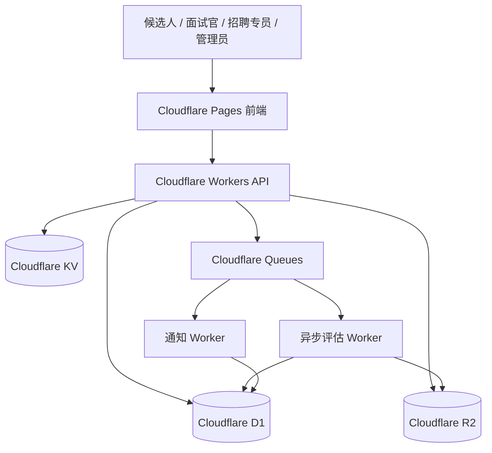
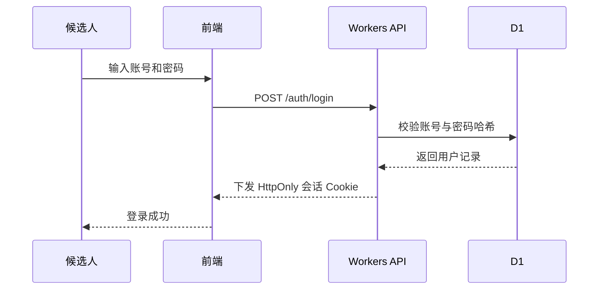
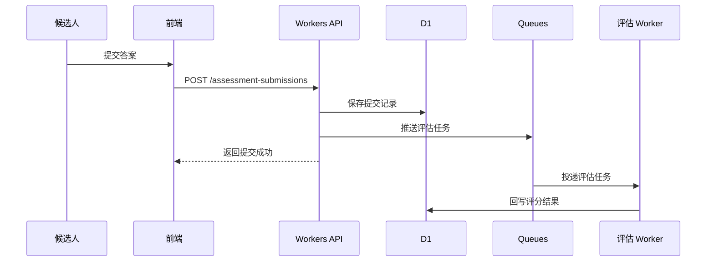
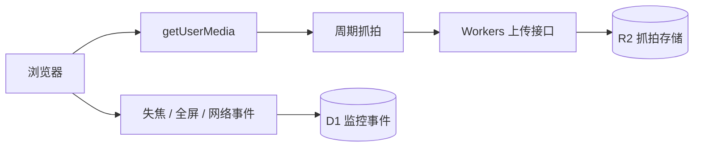

# 架构设计

## 目标

构建一个面向企业招聘 Java 开发岗位的在线测评系统，设计原则如下：

- 前端和 API 入口部署在 Cloudflare
- 客观题评分尽量异步化，避免阻塞提交流程
- 摄像头监控仅限浏览器授权与周期性抓拍
- 架构优先满足 MVP 落地，而不是一开始追求复杂能力

## 整体架构

## 核心模块

### 1. 前端层

部署在 Cloudflare Pages。

- 独立登录页，未登录时不显示业务导航
- 一套求职者端，提供候选人测评门户
- 一套企业端，给面试官、招聘专员、管理员共用
- 企业端内部按角色显示题库、评估、结果流转、系统管理等模块

### 2. API 层

部署在 Cloudflare Workers。

- 登录与会话校验
- 角色权限校验
- 题目、测评模板、招聘场次 API
- 提交答卷 API
- 摄像头抓拍上传 API
- 基础限流与防滥用

### 3. 数据层

#### Cloudflare D1

存储结构化业务数据：

- `users`
- `roles`
- `questions`
- `assessments`
- `recruitment_campaigns`
- `submissions`
- `evaluation_records`
- `proctoring_events`

#### Cloudflare R2

存储二进制与大对象：

- 题目图片
- 导入文件
- 导出报表
- 摄像头抓拍图片

#### Cloudflare KV

存储短时效、高频读取数据：

- 登录验证码
- 场次配置缓存
- 临时防作弊状态

### 4. 异步处理层

Cloudflare Queues 用于解耦提交请求和后台处理任务：

- 客观题评分
- 总分汇总
- 评估报告生成
- 通知发送

## 登录流程

## 提交流程

## 摄像头监控 MVP

这里不是实时远程监考，而是轻量级浏览器侧监控方案，适用于远程招聘测评。

- 开始测评时请求摄像头权限
- 前端周期性抓拍
- 通过 Workers 上传图片
- 图片存储到 R2
- 将拒绝授权、页面失焦、退出全屏、断网等事件写入 D1

## MVP 范围建议

优先建设：

- 账号密码登录
- 候选人、面试官、招聘专员、管理员角色
- 面向 Java 招聘的客观题与主观题
- 测评发布与限时答题
- 客观题自动评分
- 主观题人工评估
- 评估结果查询
- 摄像头抓拍与页面行为事件记录

第一版不做：

- 实时视频监考
- 音频录制
- AI 行为识别
- 第三方单点登录
- 在线代码执行

## 后续文档

- `docs/schema.md`：数据库表设计
- `docs/prd.md`：产品需求文档
- `docs/user-guide.md`：系统使用说明
- `docs/api.md`：接口设计
- `docs/mvp-plan.md`：实施计划
