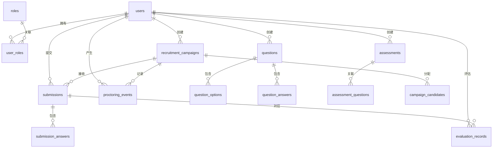

# 数据库设计

## 目标

定义一套适用于企业招聘 Java 开发测评系统的 MVP 数据库结构。

本设计覆盖：

- 账号与角色管理
- 招聘题库
- 试卷模板组装
- 笔试任务发布
- 答案提交
- 评估与结论
- 基础监控事件

## 设计原则

- 使用统一的 `users` 表，通过关联表绑定角色
- 对试卷模板和笔试任务保留必要的冗余字段，减少运行时复杂联表
- 题目定义与试卷模板分离，避免题目变更影响已发布结构
- 摄像头图片存入 R2，D1 只保存元数据

## 主要表关系

## 用户与角色

### `users`

存储登录与基础用户资料。

| 字段 | 类型 | 说明 |
| --- | --- | --- |
| id | text | 主键 |
| account | text | 唯一登录账号 |
| password_hash | text | `bcrypt` 或 `argon2` 哈希 |
| full_name | text | 展示姓名 |
| email | text | 可空 |
| mobile | text | 可空 |
| status | text | `active`、`disabled`、`locked` |
| last_login_at | integer | 可空，时间戳 |
| created_at | integer | 时间戳 |
| updated_at | integer | 时间戳 |

建议索引：

- `account` 唯一索引
- `status` 普通索引

### `roles`

系统角色定义。

| 字段 | 类型 | 说明 |
| --- | --- | --- |
| id | text | 主键 |
| code | text | 唯一值，如 `candidate`、`interviewer`、`recruiter`、`admin` |
| name | text | 角色名称 |
| created_at | integer | 时间戳 |

### `user_roles`

用户与角色的关联关系。

| 字段 | 类型 | 说明 |
| --- | --- | --- |
| id | text | 主键 |
| user_id | text | 外键，指向 `users.id` |
| role_id | text | 外键，指向 `roles.id` |
| created_at | integer | 时间戳 |

建议索引：

- `(user_id, role_id)` 唯一索引

## 题库

### `questions`

题目定义表。

| 字段 | 类型 | 说明 |
| --- | --- | --- |
| id | text | 主键 |
| type | text | `single_choice`、`multiple_choice`、`true_false`、`fill_blank`、`short_answer`、`scenario_answer` |
| stem | text | 题干 |
| analysis | text | 可空，解析 |
| difficulty | integer | 难度，1-5 |
| score | integer | 默认分值 |
| tags | text | 可空，JSON 字符串 |
| status | text | `draft`、`published`、`archived` |
| created_by | text | 外键，指向 `users.id` |
| created_at | integer | 时间戳 |
| updated_at | integer | 时间戳 |

建议索引：

- `type`
- `status`
- `created_by`

### `question_options`

选择题选项表。

| 字段 | 类型 | 说明 |
| --- | --- | --- |
| id | text | 主键 |
| question_id | text | 外键，指向 `questions.id` |
| option_key | text | `A`、`B`、`C`、`D` |
| option_text | text | 选项内容 |
| sort_order | integer | 排序 |

建议索引：

- `question_id`

### `question_answers`

标准答案与评分规则表。

| 字段 | 类型 | 说明 |
| --- | --- | --- |
| id | text | 主键 |
| question_id | text | 外键，指向 `questions.id` |
| answer_type | text | `exact`、`set_match`、`keyword`、`manual` |
| answer_content | text | JSON 字符串或纯文本 |
| case_sensitive | integer | 0 或 1 |
| created_at | integer | 时间戳 |

建议索引：

- `question_id`

## 试卷模板与笔试任务

### `assessments`

可复用的试卷模板。

| 字段 | 类型 | 说明 |
| --- | --- | --- |
| id | text | 主键 |
| title | text | 模板标题 |
| description | text | 可空 |
| total_score | integer | 缓存总分 |
| target_level | text | 可空，如 `junior`、`mid`、`senior` |
| status | text | `draft`、`published`、`archived` |
| created_by | text | 外键，指向 `users.id` |
| created_at | integer | 时间戳 |
| updated_at | integer | 时间戳 |

### `assessment_questions`

试卷模板与题目的关联表。

| 字段 | 类型 | 说明 |
| --- | --- | --- |
| id | text | 主键 |
| assessment_id | text | 外键，指向 `assessments.id` |
| question_id | text | 外键，指向 `questions.id` |
| section_name | text | 可空，题目分组 |
| sort_order | integer | 排序 |
| score | integer | 该模板中的实际分值 |

建议索引：

- `(assessment_id, question_id)` 唯一索引
- `(assessment_id, sort_order)` 普通索引

### `recruitment_campaigns`

实际发布给候选人的笔试任务。

| 字段 | 类型 | 说明 |
| --- | --- | --- |
| id | text | 主键 |
| assessment_id | text | 外键，指向 `assessments.id` |
| title | text | 任务标题 |
| description | text | 可空 |
| target_role | text | 可空，如 `java_backend`、`java_fullstack` |
| start_time | integer | 时间戳 |
| end_time | integer | 时间戳 |
| duration_minutes | integer | 可空，时长 |
| status | text | `draft`、`published`、`in_progress`、`finished`、`archived` |
| require_camera | integer | 0 或 1 |
| require_fullscreen | integer | 0 或 1 |
| created_by | text | 外键，指向 `users.id` |
| created_at | integer | 时间戳 |
| updated_at | integer | 时间戳 |

建议索引：

- `assessment_id`
- `status`
- `(start_time, end_time)`

### `campaign_candidates`

笔试任务与候选人的分配关系。

| 字段 | 类型 | 说明 |
| --- | --- | --- |
| id | text | 主键 |
| campaign_id | text | 外键，指向 `recruitment_campaigns.id` |
| user_id | text | 外键，指向 `users.id` |
| attempt_limit | integer | 默认 1 |
| invitation_status | text | `pending`、`sent`、`opened`、`completed`、`expired` |
| created_at | integer | 时间戳 |

建议索引：

- `(campaign_id, user_id)` 唯一索引

## 提交与评估

### `submissions`

候选人每次测评尝试的提交记录。

| 字段 | 类型 | 说明 |
| --- | --- | --- |
| id | text | 主键 |
| campaign_id | text | 外键，指向 `recruitment_campaigns.id` |
| user_id | text | 外键，指向 `users.id` |
| submit_no | integer | 第几次尝试 |
| status | text | `in_progress`、`submitted`、`grading`、`graded`、`expired` |
| started_at | integer | 开始时间戳 |
| submitted_at | integer | 可空，提交时间戳 |
| objective_score | integer | 客观题得分 |
| subjective_score | integer | 主观题得分 |
| total_score | integer | 总分 |
| anti_cheat_risk_level | text | `low`、`medium`、`high` |
| recommendation | text | 可空，`strong_hire`、`hire`、`hold`、`reject` |
| created_at | integer | 时间戳 |
| updated_at | integer | 时间戳 |

建议索引：

- `(campaign_id, user_id, submit_no)` 唯一索引
- `status`
- `(campaign_id, user_id)`

### `submission_answers`

每道题的作答记录。

| 字段 | 类型 | 说明 |
| --- | --- | --- |
| id | text | 主键 |
| submission_id | text | 外键，指向 `submissions.id` |
| question_id | text | 外键，指向 `questions.id` |
| answer_content | text | JSON 字符串或纯文本 |
| objective_result | text | `correct`、`wrong`、`partial`、`pending`、`reviewed` |
| objective_score | integer | 客观题得分 |
| subjective_score | integer | 主观题得分 |
| final_score | integer | 最终得分 |
| reviewer_comment | text | 可空，评语 |
| created_at | integer | 时间戳 |
| updated_at | integer | 时间戳 |

建议索引：

- `(submission_id, question_id)` 唯一索引
- `question_id`

### `evaluation_records`

自动评分与人工评估的审计记录。

| 字段 | 类型 | 说明 |
| --- | --- | --- |
| id | text | 主键 |
| submission_id | text | 外键，指向 `submissions.id` |
| submission_answer_id | text | 可空，外键，指向 `submission_answers.id` |
| evaluation_type | text | `auto`、`manual`、`recheck` |
| score_before | integer | 可空，调整前分数 |
| score_after | integer | 可空，调整后分数 |
| comment | text | 可空，评估意见 |
| evaluated_by | text | 可空，外键，指向 `users.id` |
| evaluated_at | integer | 时间戳 |

建议索引：

- `submission_id`
- `submission_answer_id`

## 监控

### `proctoring_events`

监控与基础防作弊事件记录。

| 字段 | 类型 | 说明 |
| --- | --- | --- |
| id | text | 主键 |
| campaign_id | text | 外键，指向 `recruitment_campaigns.id` |
| submission_id | text | 可空，外键，指向 `submissions.id` |
| user_id | text | 外键，指向 `users.id` |
| event_type | text | `camera_denied`、`snapshot_uploaded`、`page_blur`、`fullscreen_exit`、`network_offline`、`network_online` |
| event_value | text | 可空，JSON 字符串 |
| risk_score | integer | 风险分 |
| created_at | integer | 时间戳 |

建议索引：

- `(campaign_id, user_id)`
- `event_type`
- `created_at`

### `snapshot_files`

抓拍文件元数据表，图片本体存储在 R2。

| 字段 | 类型 | 说明 |
| --- | --- | --- |
| id | text | 主键 |
| submission_id | text | 外键，指向 `submissions.id` |
| user_id | text | 外键，指向 `users.id` |
| r2_key | text | 对象存储路径 |
| content_type | text | 图片 MIME 类型 |
| file_size | integer | 文件大小，字节 |
| captured_at | integer | 抓拍时间戳 |
| created_at | integer | 时间戳 |

建议索引：

- `submission_id`
- `user_id`

## D1 使用建议

- 主键建议使用 `ULID` 或 `UUID`
- 所有时间统一使用秒级或毫秒级时间戳，不要混用
- 结构化答案和事件详情统一序列化为 JSON 字符串
- 大文件不要写入 D1

## 下一步建议

建议补充 SQL 初始化脚本：

- `docs/migrations/001_init.sql`
- 初始化基础角色与管理员账号
